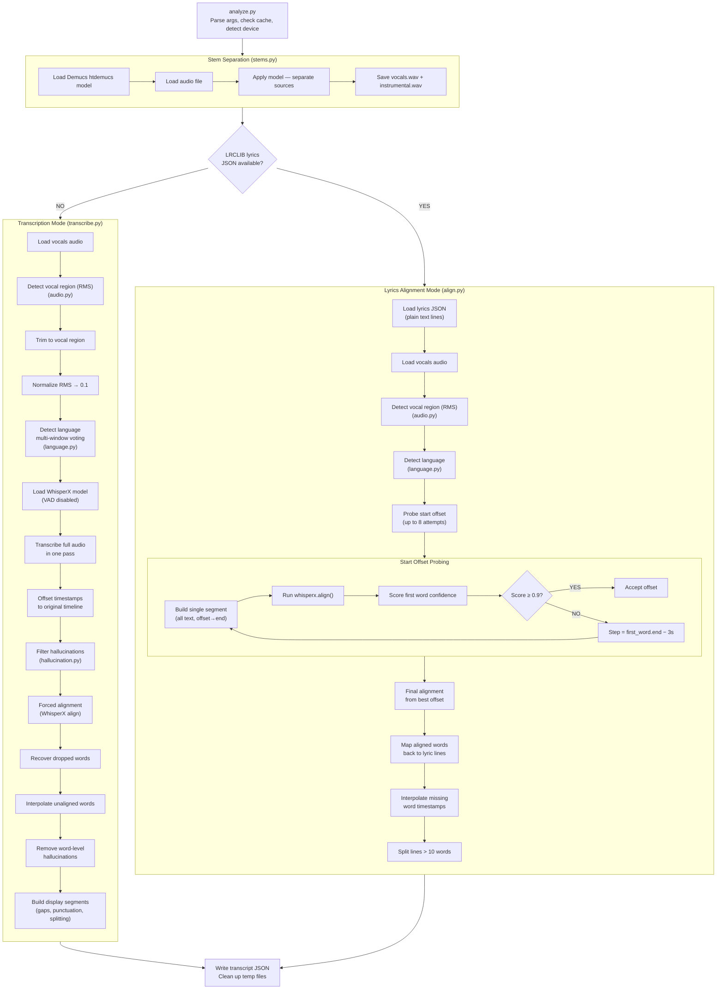
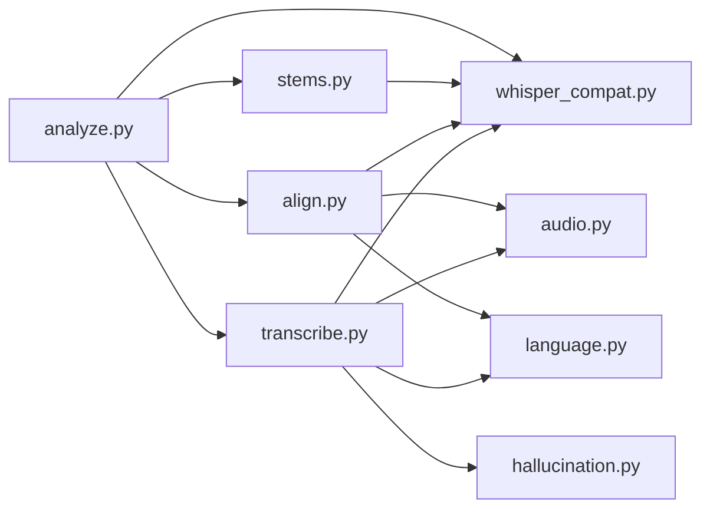

# Analyzer Architecture

## File Structure

```
analyzer/
├── analyze.py          CLI entry point & orchestrator
├── stems.py            Demucs stem separation
├── transcribe.py       WhisperX full-audio transcription (generated mode)
├── align.py            LRCLIB lyrics alignment (lyrics mode)
├── audio.py            Audio utilities (vocal detection, normalization)
├── language.py         Multi-window language detection
├── hallucination.py    Hallucination/attribution word filtering
└── whisper_compat.py   PyTorch compatibility, device detection, progress helper
```

## Pipeline Flow



## Output Format

```json
{
  "language": "en",
  "source": "lyrics | generated",
  "segments": [
    {
      "text": "Something ugly this way comes",
      "start": 46.005,
      "end": 48.465,
      "words": [
        { "word": "Something", "start": 46.005, "end": 46.765, "score": 0.757 }
      ]
    }
  ]
}
```

## Module Dependencies



## Key Design Decisions

**Single-pass transcription** — No audio chunking. The full vocal region is
transcribed in one WhisperX pass with VAD disabled. This avoids word-splitting
at chunk boundaries and gives Whisper maximum context.

**Vocal region trimming** — Before transcription, RMS energy analysis detects
where vocals actually start/end. The audio is trimmed to this region, preventing
Whisper from hallucinating on silent intros/outros. Timestamps are offset back
to the original timeline after transcription.

**Single-segment alignment** — For lyrics mode, all text is passed as one
concatenated segment spanning the full vocal region, letting the aligner freely
find word positions without artificial time constraints.

**Start offset probing** — Up to 8 alignment attempts with different start
offsets, scored by the first word's confidence. The step between probes is
derived from where the aligner placed the first word (`end - 3s`), converging
on the actual vocal start.

**Vocal region detection** — RMS energy on the Demucs vocals stem. Requires
4 consecutive active windows (2s sustained) at 15% of peak RMS to avoid
triggering on backing vocal bleed.
